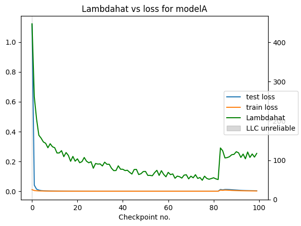
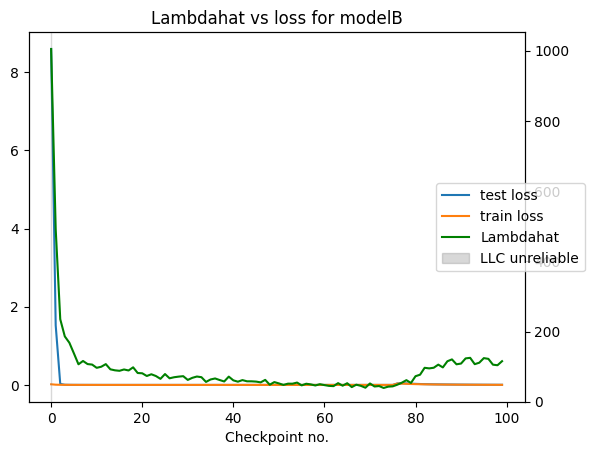

# Modular Arithmetic Pizza/Clock Exploration

Short timeboxed exploratory prototype: estimate the Local Learning Coefficient (LLC, λ̂) during grokking on modular addition across small architectures (Transformer / ConstAttn / MLP), which may learn different algorithms.

This is timeboxed as a learning exercise. Future work: more seeds, broader ablations, more data collection, and improved SGLD hyperparameter tuning.

## Quickstart
- [Main LLC inspection notebook](Modular_Arithmetic_Grokking_LLC_inspection.ipynb)
- [Additional ablations](Modular_Arithmetic_Grokking_Ablations.ipynb)

## Background / references
- Learning coefficient of modular addition: https://www.alignmentforum.org/posts/4v3hMuKfsGatLXPgt/investigating-the-learning-coefficient-of-modular-addition
- LLC / DevInterp: https://arxiv.org/abs/2308.12108
- Pizza & Clock: https://arxiv.org/abs/2306.17844

## Scope
We train three models on modular addition: `(a + b) % p` with fixed modulus `p=59`.

Models:
1. 1-layer Transformer with learned positional encodings + constant attention (Pizza/Clock `ModelA`)
2. 1-layer Transformer with learned positional encodings (Pizza/Clock `ModelB`)
3. 1-layer MLP baseline

The main notebook runs a single training run per model with a fixed seed for reproducibility. The ablations notebook explores additional seeds / hyperparameters.

## Observations
Single-seed observations unless noted; ablations suggest some trends persist across runs.

### LLC estimate (λ̂) and loss during training
**ModelA (ConstAttn)**

**ModelB (Transformer)**

In these runs, λ̂ drops sharply early in training and continues drifting downward across extended training, with a later-stage rise after long post-grokking training (single seed).

### Notes
- In these runs, λ̂ generally tracks training regime / loss scale.
- For Transformer and ConstAttn, λ̂ changes appear to coincide with shifts in algorithm metrics (per Pizza/Clock-style metrics), though this needs multi-seed confirmation.
- Example single-seed minima: ~39 (ModelA) and ~49 (ModelB) near checkpoints ~73–75.
- In long training runs, both Transformer and ConstAttn show a later-stage increase; example final values were ~115–117 (single seed).
- MLP: LLC estimate appears unreliable under current training/SGLD settings (near 0). I don’t use it for conclusions; the devinterp grokking example reports ~23 under different training conditions: https://github.com/timaeus-research/devinterp/blob/main/examples/grokking.ipynb

## What is the LLC?
The LLC comes from singular learning theory and can be interpreted (informally) as a measure of effective model complexity. Exact definitions are technical; here λ̂ is an estimate obtained via SGLD (see DevInterp paper above).

## Future work
- Engineering follow-ups: checkpointing, refactor common code into `src/`, improve logging/export, and make ablations easier to run.
- Implement more of the Pizza/Clock analysis beyond the two core algorithm metrics.
- Run broader ablations (especially ConstAttn vs Transformer) and report multi-seed confidence intervals.
